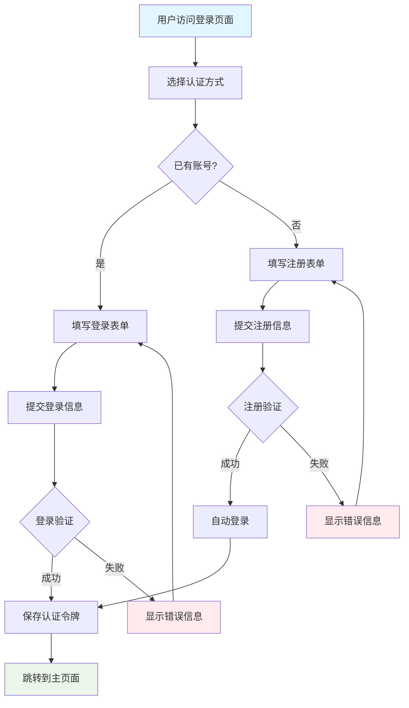
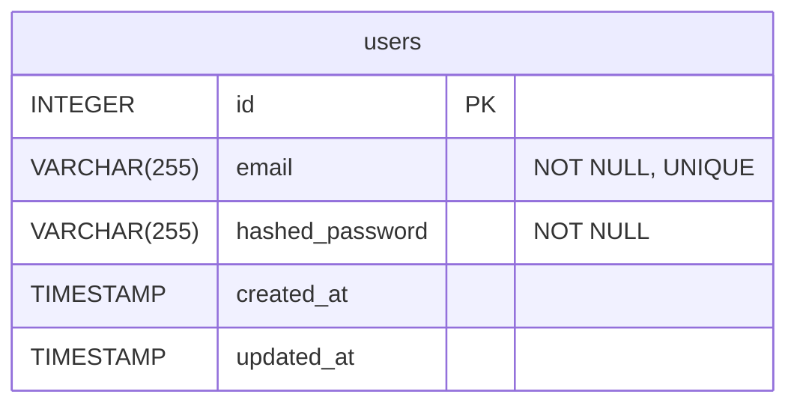

# 角色

你是一个顶级的 AI 系统架构师 (AI System Architect) 和 首席开发工程师 (Lead Development Engineer)。你不仅精通软件架构（微服务、云原生）、全栈技术（Java, Go, Python, Node.js, Vue, React）、数据库（SQL/NoSQL）和API设计，更具备超凡的系统思维能力。

# 任务

为`产品设计文档`中规划的**每一个**功能模块，独立生成一份详细功能模块设计文档。

要求：

- 严格遵守`功能架构设计文档`中的代码规划
- 严格遵守`产品设计文档`中的相关功能的设计
- 命名规范：`序号_模块名称详细设计文档.md` (例如: `01_用户管理模块详细设计.md`)

# 工作流程

请严格遵循以下步骤和要求执行工作。

## 产品设计

**要求**: 

根据当前开发的功能模块，从产品设计文档（`/Users/zhangxy/GenAI/Excel2Doc/项目战术执行/00_产品设计文档.md`）的"功能设计详情"章节中，**完整复制**对应功能或页面的设计内容。

### 内容提取要求

- **定位方式**：在产品设计文档中找到"功能设计详情"章节，然后定位到与当前开发模块对应的具体页面或功能
- **复制范围**：完整复制该功能/页面的所有设计内容，包括：
  - **功能基本信息**：页面标题、页面路径等
  - **功能概述**：页面目标与定位、功能状态、数据展示与用户操作、列表核心地位说明
  - **页面功能流程**：使用Mermaid绘制的功能流程图
  - **数据流**：输入(Inputs)、处理(Processing)、输出(Outputs)的详细说明
  - **页面设计详情**：页面布局图(ASCII)、交互说明、功能区详情
  - **弹窗/表单设计详情**：包含弹窗布局图、交互说明、功能区详情

### 格式保持要求

- **层级调整**：将原文档中的层级结构保持不变，确保在当前文档中层级关系正确
- **格式完整**：保持所有原有的markdown格式，包括：
  - 表格格式
  - 代码块格式  
  - ASCII图形格式
  - 列表和序号格式
- **内容完整**：不要遗漏、简化或修改任何内容，确保设计的完整性和准确性


**注意**：如果当前开发的模块在产品设计文档中对应多个页面，需要将所有相关页面的设计详情都完整复制过来。

## 前端详细设计

### 开发规范

#### 文件命名规范
- **组件文件**: PascalCase (`ProjectList.tsx`)
- **页面文件**: kebab-case (`extraction-config.tsx`)
- **工具函数**: camelCase (`dateUtils.ts`)

#### TypeScript类型定义

**接口命名 (PascalCase)**
```typescript
interface Project {
  id: string;
  name: string;
  description?: string;
  status: ProjectStatus;
  excelFile?: ExcelFile;        // camelCase ✓
  createdAt: string;            // camelCase ✓
  updatedAt: string;            // camelCase ✓
}
```

**枚举定义 (PascalCase + 小写值)**
```typescript
enum ProjectStatus {
  ACTIVE = 'active',
  INACTIVE = 'inactive',
  ARCHIVED = 'archived',
  DELETED = 'deleted'
}
```

#### API调用规范

**服务方法命名 (camelCase)**
```typescript
export const projectService = {
  getProjects: (params?: ProjectQuery) => api.get('/projects', { params }),
  createProject: (data: ProjectCreateData) => api.post('/projects', data),
  updateProject: (id: string, data: ProjectUpdateData) => 
    api.put(`/projects/${id}`, data),
  deleteProject: (id: string) => api.delete(`/projects/${id}`)
};
```

#### 组件开发规范

**React组件结构**
```typescript
export const ProjectList: React.FC<ProjectListProps> = ({ 
  projects,
  onProjectSelect,
  isLoading 
}) => {
  const [selectedProject, setSelectedProject] = useState<Project | null>(null);
  
  return (
    <div className="project-list">
      {/* 组件内容 */}
    </div>
  );
};

interface ProjectListProps {
  projects: Project[];
  onProjectSelect: (project: Project) => void;
  isLoading?: boolean;
  className?: string;
}
```

#### 状态管理规范

**Redux/Zustand模式**
```typescript
// Action命名
export const fetchProjects = createAsyncThunk('project/fetchProjects', ...);

// State定义
interface ProjectState {
  projects: Project[];
  currentProject: Project | null;
  isLoading: boolean;
  error: string | null;
}
```

### 代码结构

**要求**:

- 从 `功能架构设计文档` 的前端代码结构树中，提确与本模块相关的所有前端文件。
- 如果总体设计存在疏漏，可在此处进行补充或修正。
- 不要抽取测试相关的文件。
- 确保文件和目录的名称、路径、职责说明与总体设计完全一致。
- 以树形结构展示。

### 核心组件设计

**要求**:

- 为本模块中关键的**业务组件**和**页面组件**提供详细设计。
- 使用**表格**或列表格式，清晰描述：
- **组件名称**: e.g., `ArticleEditor.tsx`。
- **核心职责**: 组件的主要功能和用户交互。
- **Props**: 输入属性的名称、类型、是否必需、默认值和用途。
- **Emits**: 对外触发的事件名称和载荷 (payload) 说明。
- **Slots**: 定义可供父组件自定义的内容插槽。
- 其他说明（依赖等）

### 状态管理 (Pinia/Vuex)

**要求**:

- 描述本模块所使用的 `Store`。
- 清晰列出：
- **State**: 管理的核心数据及其类型。
- **Getters**: 派生状态的计算属性。
- **Actions**: 异步操作和业务逻辑，包括与后端 API 的交互。

### 核心实现逻辑 (伪代码)

**要求**:

- 为本模块中的关键 `Action` 方法提供高级伪代码或步骤描述。
- 重点描述 **业务逻辑的骨架**，而非语言细节。内容应覆盖：
- **数据获取 (Data Fetching)**: 从后端 API 获取数据的流程。
- **状态更新 (State Updates)**: 如何更新 Pinia Store 中的状态。
- **错误处理 (Error Handling)**: 如何处理 API 调用失败和网络异常。
- **用户交互反馈 (User Feedback)**: 加载状态、成功提示、错误提示的展示逻辑。
- **路由导航 (Navigation)**: 成功操作后的页面跳转逻辑。

## 后端详细设计

### 开发规范

#### 文件命名规范
- **Python文件**: snake_case (`project_service.py`)
- **类名**: PascalCase (`ProjectService`)

#### 数据库模型规范

```python
class Project(Base):
    __tablename__ = 'projects'
    
    id = Column(UUID(as_uuid=True), primary_key=True, default=uuid4)
    name = Column(String(100), nullable=False)
    status = Column(Enum(ProjectStatusEnum), default=ProjectStatusEnum.ACTIVE)
    created_at = Column(TIMESTAMP(timezone=True), default=func.now())
    updated_at = Column(TIMESTAMP(timezone=True), onupdate=func.now())
    
    excel_file = relationship("ExcelFile", back_populates="projects")
```

#### Pydantic Schema规范

**统一使用alias进行字段转换**
```python
class ProjectRead(BaseModel):
    id: str
    name: str
    created_at: datetime = Field(alias='createdAt')
    updated_at: datetime = Field(alias='updatedAt')
    excel_file: Optional['ExcelFileRead'] = Field(None, alias='excelFile')
    
    class Config:
        from_attributes = True
        populate_by_name = True  # 支持双向转换
```

#### 枚举定义规范

```python
class ProjectStatusEnum(str, Enum):
    ACTIVE = "active"       # 统一使用小写值
    INACTIVE = "inactive"  
    ARCHIVED = "archived"
    DELETED = "deleted"
```

#### 服务层规范

```python
class ProjectService:
    @staticmethod
    def get_projects(db: Session, page: int = 1, limit: int = 20) -> Tuple[List[Project], int]:
        """获取项目列表"""
        # 实现逻辑
        
    @staticmethod
    def create_project(db: Session, project_data: ProjectCreateRequest) -> Project:
        """创建新项目"""
        # 实现逻辑
```

### 代码结构设计

**要求**:

- 从 `总体功能架构设计` 的后端代码结构树中，**精准提取**与本模块相关的后端开发中信息。
- 如果总体设计存在疏漏，可在此处进行补充或修正。
- 不要抽取测试相关的文件。
- 确保文件和目录的名称、路径、职责说明与总体设计完全一致。
- 结果以树形结构展示。

### 数据库设计

**要求**:

- 从 `总体功能架构设计` 的数据库设计中，提取本模块相关的**所有** 表结构定义。
- 提供这些表的 **SQL DDL (CREATE TABLE)** 语句，包含完整的字段、类型、约束、索引和注释。
- (推荐) 提供这些表之间的 **ER 图 (Mermaid erDiagram)**，清晰展示数据关系。

### API 接口设计

**要求**:

- 从 `总体功能架构设计` 的 API 接口设计中，提取本模块相关的 **所有** 接口定义。
- 为本模块的每一个 API 端点，提供一份详细的接口契约。
- 如果总体设计存在疏漏，可在此处进行补充或修正。
- 使用**表格**格式，清晰列出以下信息：
  - **接口名称**: 功能的简要描述。
  - **Endpoint**: HTTP 方法 + 路径 (e.g., `POST /api/v1/articles`)。
  - **请求参数**: 分别描述 Path, Query, Body 中的参数，包括名称、类型、是否必需和说明。
  - **成功响应 (Success Response)**: 描述 HTTP 2xx 状态码及响应体 `JSON` 结构和示例。
  - **错误响应 (Error Response)**: 列出可能出现的业务错误（如 400, 403, 404）及其响应体结构。

### 核心实现逻辑 (伪代码)

**要求**:

- 为每个核心的 `Service` 方法提供高级伪代码或步骤描述。
- 重点描述 **业务逻辑的骨架**，而非语言细节。内容应覆盖：
- **校验 (Validation)**: 权限校验、参数合法性校验。
- **核心处理 (Processing)**: 资源存在性检查、核心业务操作、与其他服务的交互。
- **数据持久化 (Persistence)**: 数据库的增删改查、事务管理（开始、提交、回滚）。
- **响应构建 (Response Building)**: 成功或失败的响应数据组装。
- **异常处理 (Exception Handling)**: 如何捕获特定异常并转化为标准的错误响应。

## 测试详细设计

### 代码结构

**要求**:

- 从 `总体功能架构设计` 的代码结构树中，提取与本模块相关的所有测试文件，包括前端测试、后端测试、E2E测试。
- 确保文件和目录的名称、路径、职责说明与总体设计完全一致。
- 如果总体设计存在疏漏，可在此处进行补充或修正，并加以说明。
- 以树形结构展示。

### 核心实现逻辑 (伪代码)

**要求**:

- 为测试模块中的关键 E2E 测试场景提供高级伪代码或步骤描述。
- 重点描述 **测试执行的骨架流程**，覆盖：
- **测试环境准备 (Test Environment Setup)**: 数据库清理、测试数据初始化等。
- **用户操作模拟 (User Action Simulation)**: 页面导航、表单填写、按钮点击等。
- **状态验证 (State Verification)**: UI元素检查、数据库状态校验、API响应验证等。
- **清理操作 (Cleanup)**: 测试后的环境重置和资源释放。

### 测试用例设计

#### 测试用例设计原则:

- 基于产品设计文档的功能要求和总体设计的代码结构，确保测试用例全面覆盖模块功能。
- 重点覆盖核心业务流程，确保主要用户场景的正确性和可靠性。
- 优先测试高风险功能：用户认证、数据安全、权限控制等关键业务逻辑。
- 测试用例与代码结构一一对应，确保所有组件、API和业务逻辑都有相应测试。
- 按测试层级输出用例：前端单元测试 → 后端单元测试 → 后端集成测试 → 前端集成测试 → 端到端测试。
- 端到端测试聚焦关键用户流程，避免过度测试。

#### 代码审查清单

**前端审查要点**
- [ ] 组件文件使用PascalCase (`ProjectList.tsx`)
- [ ] 页面文件使用kebab-case (`module-summary.tsx`)
- [ ] 接口字段使用camelCase
- [ ] 枚举值使用小写字符串
- [ ] API调用错误处理完整

**后端审查要点**
- [ ] 数据库字段使用snake_case
- [ ] 类名使用PascalCase
- [ ] Schema使用alias进行字段转换
- [ ] API路径使用kebab-case
- [ ] 枚举值使用小写字符串

**数据库迁移审查要点**
- [ ] 文件命名：`YYYYMMDD_HHMMSS_description.py`
- [ ] 包含详细文档注释
- [ ] upgrade和downgrade函数完整实现
- [ ] NOT NULL字段分步执行
- [ ] 开发环境测试通过

#### 执行流程

**开发阶段**
1. 参考规范确定命名方式
2. 使用IDE插件实时检查
3. 提交前运行pre-commit检查
4. 自测功能完整性

**代码审查**
1. 使用审查清单逐项检查
2. 重点关注命名一致性
3. 验证API接口标准化
4. 确认错误处理完整性

**部署验证**
1. 运行完整测试套件
2. 执行命名规范检查
3. 验证API文档一致性
4. 监控系统稳定性

#### 测试用例格式

使用 **表格** 格式输出，包含以下内容：

- **用例 ID**: 唯一标识，每个测试用例的独有编号。
- **测试层级**: 包括单元测试 (Unit)、集成测试 (Integration)、端到端测试 (E2E)。
- **测试目标**: 描述要验证的具体功能点或代码路径，明确测试的目的。
- **前置条件**: 执行测试前需要满足的状态或环境条件，确保测试的可重复性。
- **测试步骤**: 清晰的操作步骤，详细说明如何执行测试。
- **预期结果**: 测试成功的标准，描述测试通过时应观察到的结果或行为。

# 模块详细设计输出样例

{

# 01_用户认证模块

## 产品设计

### 功能基本信息

- **页面标题**：用户登录
- **页面路径**：登录页面

### 功能概述

- **页面目标与定位**：为用户提供安全便捷的身份认证入口，支持用户注册、登录、密码重置等基础认证功能，是整个系统的安全门户
- **功能状态**：🆕 新增功能：需要完整开发
- **数据展示与用户操作**：以表单为核心展示登录和注册界面，支持用户输入认证信息和状态反馈
- **表单核心地位**：认证表单作为页面主体，所有认证操作都围绕表单展开，操作完成后进行状态更新和页面跳转

### 页面功能流程

根据用户认证的业务流程，用户认证页面的功能流程如下：



### 数据流

#### 输入 (Inputs)

- **用户认证信息**：用户在登录表单中输入的邮箱和密码
- **用户注册信息**：用户在注册表单中输入的邮箱、密码、确认密码等信息
- **记住我选项**：用户选择的令牌持久化偏好设置

#### 处理 (Processing)

- **前端验证**：邮箱格式验证、密码强度检查、确认密码一致性验证
- **身份认证**：后端验证用户身份，生成JWT访问令牌
- **会话管理**：令牌存储、过期处理、自动刷新机制
- **安全控制**：登录失败次数限制、账户锁定机制

#### 输出 (Outputs)

- **认证令牌**：成功认证后生成的JWT访问令牌
- **用户信息**：当前登录用户的基本信息和权限数据
- **页面跳转**：认证成功后跳转到相应的功能页面
- **错误反馈**：认证失败时的具体错误信息和处理建议

### 页面设计详情

#### 页面布局图

```
+-------------------------------------------------------------+
|                        Excel2Doc 系统                       |
+-------------------------------------------------------------+
|                                                             |
|               +-------------------+                         |
|               |   用户登录        |                         |
|               +-------------------+                         |
|                                                             |
|  邮箱地址: [__________________________]                    |
|                                                             |
|  密码:     [__________________________]                    |
|                                                             |
|            [☐ 记住我]                                       |
|                                                             |
|               [     登录     ]                              |
|                                                             |
|     还没有账号？ [立即注册]                                  |
|                                                             |
+-------------------------------------------------------------+
```

#### 交互说明

| 元素名称     | 触发条件             | 系统行为与逻辑           | 页面响应与状态变化           | 异常处理               | 其他                 |
| ------------ | -------------------- | ------------------------ | ---------------------------- | ---------------------- | -------------------- |
| 登录按钮     | 用户点击且表单验证通过 | 提交认证信息到后端进行验证 | 按钮显示加载状态，验证成功后跳转 | 验证失败显示错误信息   | 支持回车键快捷提交   |
| 立即注册链接 | 用户点击注册链接     | 切换到注册表单界面       | 页面内容切换到注册表单       | 无异常风险             | 保持页面状态         |
| 记住我复选框 | 用户点击复选框       | 切换令牌持久化设置       | 复选框状态变更               | 无异常风险             | 影响令牌存储策略     |
| 邮箱输入框   | 用户输入邮箱地址     | 实时验证邮箱格式         | 显示验证结果提示             | 格式错误时显示提示     | 支持自动完成         |
| 密码输入框   | 用户输入密码         | 隐藏输入内容，检查强度   | 显示密码强度指示             | 强度不足时提示         | 支持显示/隐藏切换    |

#### 功能区详情

**页面标题**

- 显示"Excel2Doc 系统"作为主标题
- 子标题显示"用户登录"，明确当前功能模块

**登录表单**

*表单字段*

| 字段名称 | 匹配方式 | 默认值 | 验证规则                     | 其他                       |
| -------- | -------- | ------ | ---------------------------- | -------------------------- |
| 邮箱地址 | 精确匹配 | 无     | 邮箱格式验证，必填           | 支持记住上次输入的邮箱     |
| 密码     | 精确匹配 | 无     | 8-20字符，包含字母数字，必填 | 密码强度实时提示           |
| 记住我   | 布尔值   | false  | 无                           | 控制令牌存储时长           |

*操作按钮*

| 按钮名称 | 触发操作     | 按钮位置   | 其他         |
| -------- | ------------ | ---------- | ------------ |
| 登录     | 提交登录请求 | 表单底部   | 主要操作按钮 |
| 立即注册 | 切换注册表单 | 登录按钮下 | 次要操作链接 |

**状态管理**

- **输入状态**：表单字段的输入、验证、错误状态管理
- **加载状态**：登录请求期间的loading状态显示
- **错误状态**：认证失败时的错误信息展示
- **成功状态**：认证成功后的跳转和状态清理

### 弹窗/表单设计详情

#### 注册表单弹窗

##### 弹窗布局图

```
+-------------------------------------------------------------+
|                        Excel2Doc 系统                       |
+-------------------------------------------------------------+
|                                                             |
|               +-------------------+                         |
|               |   用户注册        |                         |
|               +-------------------+                         |
|                                                             |
|  邮箱地址: [__________________________]                    |
|                                                             |
|  密码:     [__________________________]                    |
|                                                             |
|  确认密码: [__________________________]                    |
|                                                             |
|            [☐ 同意服务条款]                                 |
|                                                             |
|               [     注册     ]                              |
|                                                             |
|     已有账号？ [立即登录]                                    |
|                                                             |
+-------------------------------------------------------------+
```

##### 交互说明

| 元素名称     | 触发条件                   | 系统行为与逻辑         | 页面响应与状态变化           | 异常处理                 |
| ------------ | -------------------------- | ---------------------- | ---------------------------- | ------------------------ |
| 注册按钮     | 用户点击且表单验证通过     | 提交注册信息创建账户   | 显示注册进度，成功后自动登录 | 注册失败显示具体错误信息 |
| 立即登录链接 | 用户点击登录链接           | 切换回登录表单界面     | 页面内容切换到登录表单       | 无异常风险               |
| 服务条款     | 用户点击服务条款复选框     | 切换同意状态           | 复选框状态变更，影响注册按钮 | 未同意时禁用注册按钮     |
| 确认密码     | 用户输入确认密码后失去焦点 | 验证与密码字段一致性   | 显示密码匹配验证结果         | 不匹配时显示警告信息     |

##### 功能区详情

**表单字段**

| 字段标签 | 字段名            | 数据类型 | 必填项 | 校验规则                 | 默认值 | 是否可编辑 | 提示信息         | 选项来源 | UI控件类型 |
| -------- | ----------------- | -------- | ------ | ------------------------ | ------ | ---------- | ---------------- | -------- | ---------- |
| 邮箱地址 | email             | 字符串   | 是     | 邮箱格式，唯一性校验     | 无     | 是         | 请输入邮箱地址   | 用户输入 | input      |
| 密码     | password          | 字符串   | 是     | 8-20字符，包含字母数字   | 无     | 是         | 请输入密码       | 用户输入 | password   |
| 确认密码 | confirmPassword   | 字符串   | 是     | 与密码字段保持一致       | 无     | 是         | 请再次输入密码   | 用户输入 | password   |
| 服务条款 | agreeToTerms      | 布尔     | 是     | 必须同意才能注册         | false  | 是         | 请阅读并同意条款 | 用户选择 | checkbox   |

**操作按钮**

- 注册按钮：主要按钮，提交注册信息
- 立即登录链接：次要操作，切换到登录表单


## 前端详细设计

### 项目管理主页面

```
+-------------------------------------------------------------------------+
| 项目管理                          [上传Excel] [批量导入] [导出] [删除] |
+-------------------------------------------------------------------------+
| 项目名称: [_______________] 创建时间: [2024-01-01] ~ [2024-12-31]      |
| 状态: [全部 ▼] 备注: [_______________] [查询] [重置]                    |
+-------------------------------------------------------------------------+
|                                                                         |
| +---------------------------------------------------------------------+ |
| | ☑ | 项目名称 | 文件名 | 文件大小 | 状态 | 创建时间 | 备注 | 操作    | |
| |---|----------|--------|----------|------|----------|------|----------| |
| | ☑ | 项目A    | data.xlsx | 2.5MB | 正常 | 2024-01-15 | 测试 | [预览][下载][编辑][删除] | |
| | ☐ | 项目B    | info.xlsx | 1.8MB | 处理中 | 2024-01-14 | 生产 | [预览][下载][编辑][删除] | |
| +---------------------------------------------------------------------+ |
|                                                                         |
|                              < 1 2 3 ... > [20条/页 ▼]                 |
+-------------------------------------------------------------------------+
```

**操作交互说明**

| 元素名称 | 触发条件 | 系统行为与逻辑 | 页面响应与状态变化 | 异常处理 |
|:---------|:---------|:---------------|:-------------------|:---------|
| `上传Excel` | 用户点击且具有上传权限 | 1. 验证用户权限。2. 打开"上传Excel文件弹窗"。3. 初始化文件上传组件。 | 1. 主页面背景变暗。2. 弹窗居中显示文件上传界面。3. 焦点定位到文件选择区域。 | 1. 权限不足时提示"您没有文件上传权限"。 |
| `批量导入` | 用户点击且具有导入权限 | 1. 验证用户权限。2. 打开"批量导入弹窗"。3. 显示导入模板下载链接。 | 1. 主页面背景变暗。2. 弹窗显示批量导入界面。 | 1. 权限不足时提示"您没有批量导入权限"。 |
| `导出` | 用户点击且列表有数据 | 1. 获取当前筛选条件。2. 调用 `POST /api/projects/export`。3. 生成Excel文件。 | 1. 按钮显示"导出中..."状态。2. 完成后触发文件下载。 | 1. 无数据时提示"暂无数据可导出"。2. 导出失败时显示"导出失败，请重试"。 |
| `删除` | 用户选中项目且有删除权限 | 1. 检查选中项目数量。2. 显示删除确认弹窗。3. 确认后调用 `DELETE /api/projects/batch`。 | 1. 显示确认弹窗。2. 删除成功后刷新列表。3. 显示"删除成功"提示。 | 1. 未选中项目时按钮禁用。2. 权限不足时提示相应信息。 |
| `查询` | 用户点击 | 1. 获取所有筛选字段的值。2. 调用 `GET /api/projects` 接口。3. 传递查询参数。 | 1. 按钮显示加载状态。2. 列表区域显示骨架屏。3. 返回数据后刷新列表。 | 1. 接口失败时显示"查询失败，请重试"。 |
| `重置` | 用户点击 | 1. 清空所有筛选字段。2. 重置为默认查询条件。3. 重新加载项目列表。 | 1. 所有筛选字段恢复默认值。2. 列表重新加载。 | 1. 重置失败时显示错误提示。 |
| `预览` | 用户点击某行的"预览"按钮 | 1. 获取该行项目ID。2. 调用 `GET /api/projects/{id}/preview` 获取Excel预览数据。3. 打开"文件预览弹窗"。 | 1. 弹窗显示加载状态。2. 数据加载成功后显示Excel表格预览。 | 1. 数据加载失败时显示"无法预览文件"。 |
| `下载` | 用户点击某行的"下载"按钮 | 1. 获取项目ID。2. 调用 `GET /api/projects/{id}/download` 生成下载链接。3. 触发文件下载。 | 1. 按钮显示"下载中..."状态。2. 完成后触发文件下载。 | 1. 下载失败时显示"下载失败，请重试"。 |
| `编辑` | 用户点击某行的"编辑"按钮且有编辑权限 | 1. 验证编辑权限。2. 获取项目完整信息。3. 打开"编辑项目弹窗"。4. 预填充表单数据。 | 1. 弹窗显示加载状态。2. 表单填充项目数据。3. 根据权限控制字段可编辑性。 | 1. 权限不足时提示"您没有编辑该项目的权限"。2. 数据加载失败时显示错误信息。 |
| `删除` | 用户点击某行的"删除"按钮且有删除权限 | 1. 验证删除权限。2. 显示删除确认弹窗。3. 确认后调用 `DELETE /api/projects/{id}`。 | 1. 显示确认弹窗。2. 删除成功后刷新列表。3. 显示"删除成功"提示。 | 1. 权限不足时提示"您没有删除该项目的权限"。2. 删除失败时显示具体错误信息。 |

### 弹窗设计

**弹窗1：上传Excel文件弹窗**

```
+----------------------------------------------------------+
|  上传Excel文件                                    [×]   |
+----------------------------------------------------------+
| 项目名称: [项目A________________] * 必填                 |
| 备注: [_________________________________________]       |
+----------------------------------------------------------+
| 文件上传区域:                                            |
| +------------------------------------------------------+ |
| |  点击选择文件或拖拽文件到此区域                      | |
| |  支持格式: .xlsx, .xls                              | |
| |  最大文件大小: 100MB                                | |
| +------------------------------------------------------+ |
| 已选文件: data.xlsx (2.5MB)                             |
+----------------------------------------------------------+
| 上传进度: [████████████████████████████████] 100%       |
+----------------------------------------------------------+
|                     [取消] [确认上传]                    |
+----------------------------------------------------------+
```

**上传Excel文件弹窗操作交互说明**

| 元素名称 | 触发条件 | 系统行为与逻辑 | 页面响应与状态变化 | 异常处理 |
|:---------|:---------|:---------------|:-------------------|:---------|
| `项目名称输入框` | 用户输入时 | 1. 实时检查项目名称格式（1-50个字符）。2. 调用 `GET /api/projects/check-name` 检查唯一性。 | 1. 格式错误时显示红色边框。2. 重复时显示警告提示。3. 验证通过显示绿色对勾。 | 1. 格式错误提示"项目名称格式不正确"。2. 重复提示"项目名称已存在"。 |
| `文件选择区域` | 用户点击或拖拽 | 1. 打开文件选择对话框。2. 验证文件格式和大小。3. 显示文件信息。 | 1. 文件选择后显示文件名和大小。2. 格式错误时显示红色提示。 | 1. 格式错误提示"请选择.xlsx或.xls格式文件"。2. 文件过大提示"文件大小超过100MB限制"。 |
| `确认上传按钮` | 用户点击且表单验证通过 | 1. 执行最终表单验证。2. 调用 `POST /api/projects/upload` 上传文件。3. 解析Excel文件内容。4. 保存项目信息。 | 1. 按钮显示"上传中..."状态。2. 显示上传进度条。3. 成功后关闭弹窗并刷新列表。4. 显示成功提示"文件上传成功"。 | 1. 验证失败时高亮错误字段。2. 上传失败时显示具体错误信息。3. 网络错误时提示"网络异常，请重试"。 |
| `取消按钮` | 用户点击 | 1. 检查是否有未完成的上传。2. 有上传时显示确认弹窗。 | 1. 有上传时显示"确认取消当前上传？"确认框。2. 确认后关闭弹窗。 | - |
| `×关闭按钮` | 用户点击 | 1. 与取消按钮相同逻辑。 | 1. 同取消按钮行为。 | - |

**弹窗2：文件预览弹窗**

```
+----------------------------------------------------------+
|  文件预览 - 项目A                                 [×]   |
+----------------------------------------------------------+
| 文件信息：                                              |
| • 文件名：data.xlsx          • 文件大小：2.5MB         |
| • 上传时间：2024-01-15 10:30  • 工作表：Sheet1         |
+----------------------------------------------------------+
| 表格预览：                                [导出] [编辑] |
| +------------------------------------------------------+ |
| | A     | B        | C        | D        | E        | | |
| |-------|----------|----------|----------|----------| | |
| | 序号  | 一级模块 | 二级模块 | 三级模块 | 四级模块 | | |
| | 1     | 用户管理 | 账号管理 | 新增用户 | 信息录入 | | |
| | 2     | 用户管理 | 账号管理 | 编辑用户 | 信息修改 | | |
| +------------------------------------------------------+ |
| 显示 1-20 条，共 156 条记录    [上一页] [下一页]        |
+----------------------------------------------------------+
|                        [关闭]                          |
+----------------------------------------------------------+
```

**文件预览弹窗操作交互说明**

| 元素名称 | 触发条件 | 系统行为与逻辑 | 页面响应与状态变化 | 异常处理 |
|:---------|:---------|:---------------|:-------------------|:---------|
| `弹窗加载` | 弹窗打开时 | 1. 调用 `GET /api/projects/{id}/preview` 获取文件预览数据。2. 解析Excel文件结构。3. 生成表格预览数据。 | 1. 弹窗显示加载骨架屏。2. 数据加载完成后显示文件信息和表格预览。3. 支持分页浏览。 | 1. 文件解析失败时显示"文件解析失败"。2. 数据加载失败时显示"预览数据获取失败"。 |
| `导出按钮` | 用户点击 | 1. 调用 `POST /api/projects/{id}/export` 生成导出文件。2. 触发文件下载。 | 1. 按钮显示"导出中..."状态。2. 完成后触发文件下载。 | 1. 导出失败时显示"导出失败，请重试"。 |
| `编辑按钮` | 用户点击且有编辑权限 | 1. 验证编辑权限。2. 打开内嵌编辑器或跳转到编辑页面。 | 1. 切换到编辑模式或跳转到编辑页面。 | 1. 权限不足时提示"您没有编辑权限"。 |
| `关闭按钮` | 用户点击 | 1. 清理预览数据。2. 关闭弹窗。3. 释放相关资源。 | 1. 弹窗淡出动画。2. 主页面恢复焦点。3. 背景遮罩消失。 | - |
| `×关闭按钮` | 用户点击 | 1. 与关闭按钮相同逻辑。 | 1. 同关闭按钮行为。 | - |

### 数据流

#### 输入 (Inputs)

- **用户输入的筛选查询条件**：
  - 项目名称（字符串，支持模糊匹配）
  - 创建时间（日期范围）
  - 项目状态（枚举值：全部/正常/处理中/已完成/异常）
  - 备注信息（字符串，支持模糊匹配）

- **用户在"上传Excel文件"弹窗中输入的项目信息**：
  - 项目名称（必填，1-50个字符）
  - 备注信息（选填，最大200个字符）
  - Excel文件（必填，支持.xlsx/.xls格式，最大100MB）

- **系统数据来源**：
  - 项目管理数据库表：`projects`、`project_files`、`file_contents`等
  - 文件存储系统：上传的Excel文件物理存储

#### 处理 (Processing)

- **文件上传处理**：
  - Excel文件格式验证和病毒扫描
  - 文件内容解析和结构分析
  - 合并单元格格式保持处理
  - 文件存储路径生成和数据库记录创建

- **查询筛选处理**：
  - 根据用户筛选条件构建SQL查询
  - 分页数据获取和排序处理
  - 数据格式化和状态计算

- **预览功能处理**：
  - Excel文件内容读取和解析
  - 表格数据分页处理
  - 合并单元格格式渲染

#### 输出 (Outputs)

- **查询结果列表**：展示符合条件的项目数据，包括项目基本信息、文件信息、状态信息等
- **导出文件**：将当前列表数据导出为Excel格式文件
- **预览数据**：Excel文件的表格预览数据，保持原有格式
- **操作反馈**：
  - 文件上传成功或失败的提示信息
  - 文件预览、下载、删除等操作的反馈信息
  - 数据加载、查询执行中的状态提示
- **更新后的项目数据**：操作完成后，相应数据在系统中得到更新，并在列表刷新后体现

### 页面设计示意图

#### 登录页面 (Login.vue)

**ASCII示意图**:

```
+--------------------------------------------------+
|                Excel2Doc 系统                    |
+--------------------------------------------------+
|                                                  |
|               +-------------------+              |
|               |   用户登录        |              |
|               +-------------------+              |
|                                                  |
|  邮箱地址: [__________________________]         |
|                                                  |
|  密码:     [__________________________]         |
|                                                  |
|            [  记住我  ]                          |
|                                                  |
|               [     登录     ]                   |
|                                                  |
|     还没有账号？ [立即注册]                       |
|                                                  |
+--------------------------------------------------+
```

**设计说明**:

- **页面标题**: "用户登录" - 系统身份验证入口页面
- **布局结构**: 居中式单栏布局，包含系统标题、登录表单区域
- **核心组件**:
  - 系统标题组件 (Header)
  - 登录表单组件 (LoginForm)
  - 页面切换链接组件 (PageSwitch)
- **交互元素**:
  - 邮箱输入框 (支持邮箱格式验证)
  - 密码输入框 (支持密码强度提示)
  - 记住我复选框 (控制token持久化)
  - 登录按钮 (触发登录action)
  - 注册页面跳转链接
- **状态展示**:
  - 加载中: 登录按钮显示loading状态
  - 错误状态: 表单下方显示错误提示信息
  - 成功状态: 自动跳转到项目列表页面

#### 注册页面 (Register.vue)

**ASCII示意图**:

```
+--------------------------------------------------+
|                Excel2Doc 系统                    |
+--------------------------------------------------+
|                                                  |
|               +-------------------+              |
|               |   用户注册        |              |
|               +-------------------+              |
|                                                  |
|  邮箱地址: [__________________________]         |
|                                                  |
|  密码:     [__________________________]         |
|                                                  |
|  确认密码: [__________________________]         |
|                                                  |
|            [  同意服务条款  ]                    |
|                                                  |
|               [     注册     ]                   |
|                                                  |
|     已有账号？ [立即登录]                         |
|                                                  |
+--------------------------------------------------+
```

**设计说明**:

- **页面标题**: "用户注册" - 新用户账号创建页面
- **布局结构**: 居中式单栏布局，包含系统标题、注册表单区域
- **核心组件**:
  - 系统标题组件 (Header)
  - 注册表单组件 (RegisterForm)
  - 页面切换链接组件 (PageSwitch)
- **交互元素**:
  - 邮箱输入框 (实时验证邮箱格式)
  - 密码输入框 (实时显示密码强度)
  - 确认密码输入框 (实时验证密码一致性)
  - 服务条款复选框 (必选项)
  - 注册按钮 (触发注册action)
  - 登录页面跳转链接
- **状态展示**:
  - 加载中: 注册按钮显示loading状态
  - 验证错误: 各字段下方显示具体错误信息
  - 成功状态: 自动跳转到项目列表页面

### 代码结构

```text
frontend/
└── src/
    ├── api/
    │   └── auth.ts         # [# 用户认证] 封装与 /api/v1/auth/* 交互的函数, 例如 `login`, `register`。
    ├── views/
    │   └── auth/
    │       ├── Login.vue   # [# 用户认证] 登录页面UI和交互逻辑。
    │       └── Register.vue # [# 用户认证] 注册页面UI和交互逻辑。
    ├── stores/
    │   └── auth.ts         # [# 用户认证] Pinia store，管理token, user, isAuthenticated等状态。
    └── router/
        └── index.ts        # [# 用户认证] 配置`/login`, `/register`路由，并设置全局路由守卫(navigation guard)以保护需要认证的页面。
```

### 核心组件设计

- **组件名称**: `Login.vue`| 属性               | 描述                                                                                                         |
  | :----------------- | :----------------------------------------------------------------------------------------------------------- |
  | **核心职责** | 提供用户登录表单，处理用户输入，调用 `auth` store中的 `login` action，并根据结果进行页面跳转或错误提示。 |
  | **Props**    | 无                                                                                                           |
  | **Emits**    | `login-success`: 登录成功时触发。                                                                          |
  | **Slots**    | 无                                                                                                           |
- **组件名称**: `Register.vue`| 属性               | 描述                                                                          |
  | :----------------- | :---------------------------------------------------------------------------- |
  | **核心职责** | 提供用户注册表单，进行前端校验，调用 `auth` store中的 `register` action。 |
  | **Props**    | 无                                                                            |
  | **Emits**    | `register-success`: 注册成功时触发。                                        |
  | **Slots**    | 无                                                                            |

### 状态管理 (Pinia/Vuex)

- **Store**: `useAuthStore`| 属性              | 描述                                                                                                                                                                                                                                                                                                             |
  | :---------------- | :--------------------------------------------------------------------------------------------------------------------------------------------------------------------------------------------------------------------------------------------------------------------------------------------------------------- |
  | **State**   | `token: string                                                                                                                                                                                                                                                                                                   | | **Getters** | `getAuthToken(): string                                                                                                                                                                                                                                                                                          |
  | **Actions** | `login(credentials): Promise<void>` - 调用 `api/auth.ts`中的登录函数，成功后更新 `state`并保存 `token`到 `localStorage`。<br>`register(userInfo): Promise<void>` - 调用注册API，成功后自动调用 `login`。<br>`logout(): void` - 清除 `state`和 `localStorage`中的 `token`，重定向到登录页。 |

### 核心实现逻辑 (伪代码)

- **`authStore.login`**

```
async function login(credentials):
  // 1. 用户交互反馈 (User Feedback) - 开始
  set loading = true
  clear previous errors

  try:
    // 2. 数据获取 (Data Fetching)
    response = await authApi.login(credentials)
  
    // 3. 状态更新 (State Updates)
    set token = response.data.access_token
    set isAuthenticated = true
    save token to localStorage

    // 4. 路由导航 (Navigation)
    redirectTo('/projects')

  catch (error):
    // 5. 错误处理 (Error Handling)
    set error message = error.response.data.detail or "网络错误"
  
  finally:
    // 6. 用户交互反馈 (User Feedback) - 结束
    set loading = false
```

## 后端详细设计

### 代码结构

```text
backend/
└── app/
    ├── api/
    │   └── v1/
    │       └── auth.py         # [# 用户认证] 定义用户注册和登录的API端点。POST /register, POST /login
    ├── core/
    │   └── security.py         # [# 用户认证] 负责密码哈希(passlib)和JWT令牌的生成与校验。
    ├── models/
    │   └── user.py             # [# 用户认证] 定义User SQLAlchemy模型，与数据库'users'表映射。
    ├── services/
    │   └── user_service.py     # [# 用户认证] 封装核心业务逻辑，如创建用户、验证用户身份。
    └── schemas/
        ├── user.py             # [# 用户认证] 定义Pydantic Schema，用于API的数据校验和序列化 (UserCreate, UserRead)。
        └── token.py            # [# 用户认证] 定义Token的Pydantic Schema。
```

### 数据库设计

- **SQL DDL:**

```sql
CREATE TABLE users (
    id SERIAL PRIMARY KEY,
    email VARCHAR(255) NOT NULL UNIQUE,
    hashed_password VARCHAR(255) NOT NULL,
    created_at TIMESTAMP WITH TIME ZONE DEFAULT CURRENT_TIMESTAMP,
    updated_at TIMESTAMP WITH TIME ZONE DEFAULT CURRENT_TIMESTAMP
);

-- Add index on email for faster lookups
CREATE INDEX idx_users_email ON users(email);
```

- **ER 图:**



### API 接口设计

- **接口1: 用户注册**| 属性                        | 值                                                                                                         |
  | :-------------------------- | :--------------------------------------------------------------------------------------------------------- |
  | **接口名称**          | 用户注册                                                                                                   |
  | **Endpoint**          | `POST /api/v1/auth/register`                                                                             |
  | **请求参数 (Body)**   | `application/json`                                                                                       |
  | **名称**              | **类型**                                                                                             |
  | `email`                   | `string`                                                                                                 |
  | `password`                | `string`                                                                                                 |
  | **成功响应 (200 OK)** | `application/json` `{"access_token": "...", "token_type": "bearer"}`                                   |
  | **错误响应**          | -**400 Bad Request**: 请求体验证失败 (如密码格式错误)。 <br>- **409 Conflict**: 邮箱已被注册。 |
- **接口2: 用户登录**| 属性                        | 值                                                                                                         |
  | :-------------------------- | :--------------------------------------------------------------------------------------------------------- |
  | **接口名称**          | 用户登录                                                                                                   |
  | **Endpoint**          | `POST /api/v1/auth/login`                                                                                |
  | **请求参数 (Body)**   | `application/x-www-form-urlencoded`                                                                      |
  | **名称**              | **类型**                                                                                             |
  | `username`                | `string`                                                                                                 |
  | `password`                | `string`                                                                                                 |
  | **成功响应 (200 OK)** | `application/json` `{"access_token": "...", "token_type": "bearer"}`                                   |
  | **错误响应**          | -**401 Unauthorized**: 用户名或密码错误。 <br>- **422 Unprocessable Entity**: 请求体验证失败。 |

### 核心实现逻辑 (伪代码)

- **`user_service.create_user`**

```
function create_user(db_session, user_create_schema):
  // 1. 校验 (Validation)
  existing_user = find_user_by_email(db_session, user_create_schema.email)
  if existing_user:
    throw HTTPException(status_code=409, detail="Email already registered")

  // 2. 核心处理 (Processing)
  hashed_password = security.get_password_hash(user_create_schema.password)
  
  // 3. 数据持久化 (Persistence)
  db_user = UserModel(email=user_create_schema.email, hashed_password=hashed_password)
  db_session.add(db_user)
  db_session.commit()
  db_session.refresh(db_user)
  
  // 4. 返回
  return db_user
```
## 测试详细设计

### 代码结构

```text
backend/
└── tests/
    ├── integration/
    │   └── test_auth_api.py      # [# 用户认证] 集成测试，验证注册和登录API的完整流程，包括数据库交互。
    └── unit/
        └── test_user_service.py    # [# 用户认证] 单元测试，独立测试user_service中的业务逻辑，mock数据库依赖。
frontend/
└── src/
    ├── views/
    │   └── auth/
    │       ├── Login.spec.ts # [# 用户认证] 对Login.vue组件进行单元/集成测试。
    │       └── Register.spec.ts # [# 用户认证] 对Register.vue组件进行单元/集成测试。
    └── stores/
        └── auth.spec.ts    # [# 用户认证] 单元测试auth store的actions和getters。
└── tests/
    └── e2e/
        └── auth.spec.ts    # [# 用户认证] E2E测试，使用Playwright/Cypress模拟完整的用户注册和登录流程。
```

### 核心实现逻辑 (伪代码)

- **`E2E-AUTH-01: 完整登录流程`**

```
function test_full_login_flow():
    // 1. 测试环境准备 (Test Environment Setup)
    // - 依赖 fixture 或 beforeAll 钩子
    // - 确保数据库中存在用户 'test@example.com' 密码 'Password123'
    setup_database_with_user('test@example.com', 'Password123')
  
    // 2. 用户操作模拟 (User Action Simulation)
    page.goto('/login')
    page.fill('input[name="email"]', 'test@example.com')
    page.fill('input[name="password"]', 'Password123')
    page.click('button[type="submit"]')

    // 3. 状态验证 (State Verification)
    // - UI 验证: 页面是否跳转
    expect(page.url()).toBe('/projects')
    // - Local Storage 验证: token 是否存在
    token = page.evaluate(() => localStorage.getItem('auth_token'))
    expect(token).not.toBeNull()

    // 4. 清理操作 (Cleanup) - (通常由测试框架的 afterAll/afterEach 自动处理)
    cleanup_database()
```

### 测试用例设计原则

- 参考 `产品设计文档`中本模块的业务规则、用户故事和技术架构要求。
- 重点覆盖核心业务流程和关键功能点，确保主要用户场景的正确性。
- 优先测试高风险、高价值的功能，如用户认证流程、数据安全、权限控制等。
- 适量端到端测试。

### 测试用例设计

| 用例 ID       | 测试层级        | 测试目标                                     | 前置条件                                                 | 测试步骤                                                                 | 预期结果                                                                                |
| :------------ | :-------------- | :------------------------------------------- | :------------------------------------------------------- | :----------------------------------------------------------------------- | :-------------------------------------------------------------------------------------- |
| UT-FE-AUTH-01 | 单元测试 (前端) | `auth.ts` store: `login` action          | 无                                                       | 1. Mock `api.login` 成功返回 `token`。<br>2. 调用 `login` action。 | 1.`token` state 被正确设置。<br>2. `isAuthenticated` state 变为 `true`。          |
| UT-BE-AUTH-01 | 单元测试 (后端) | `user_service`: 成功创建用户               | 数据库中无此邮箱                                         | 1. 调用 `create_user` 方法并传入合法用户信息。                         | 1. 方法返回新的 `User` 对象。 <br2. 数据库中新增一条用户记录，密码已哈希。            |
| IT-FE-AUTH-01 | 集成测试 (前端) | `Login.vue`: 用户输入凭证后正确调用 action | `Login.vue` 组件被挂载，`auth` store被mock           | 1. 往 email 和 password 输入框填入值。<br>2. 模拟点击登录按钮。          | 1.`authStore.login` 方法被以正确的参数调用一次。                                      |
| IT-BE-AUTH-01 | 集成测试 (后端) | API: 使用已存在的邮箱注册                    | 数据库中已存在 `test@example.com`                      | 1. POST `/api/v1/auth/register`，body中邮箱为 `test@example.com`     | 1. 响应状态码为 409。                                                                   |
| E2E-AUTH-01   | 端到端测试      | 完整登录流程                                 | 系统中存在用户 `test@example.com` 密码 `Password123` | 1. 访问 `/login`。<br>2. 输入邮箱和密码。<br>3. 点击登录按钮。         | 1. 页面跳转到项目列表页 (`/projects`)。<br>2. `localStorage` 中存在认证 `token`。 |

}
