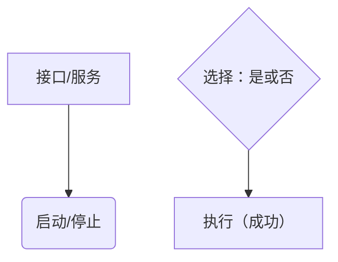
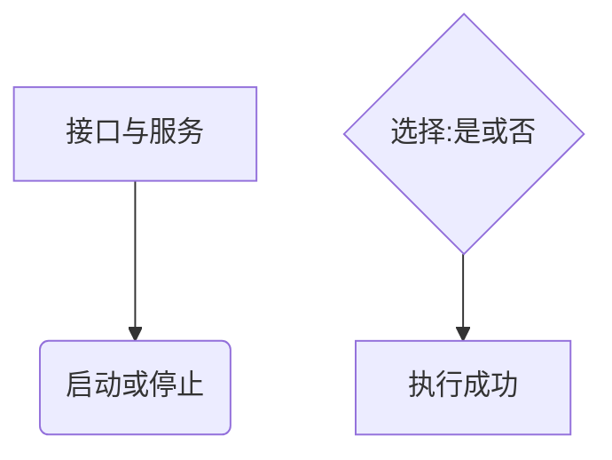
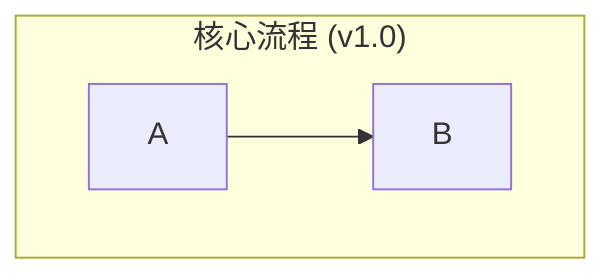
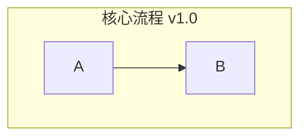

# Mermaid v8.8 语法规范与避错指南

本文档旨在总结在 Mermaid v8.8 版本中绘制图表时遇到的常见问题和语法陷阱，提供一套稳定、兼容的最佳实践，以避免未来开发中出现类似的渲染错误。

## 1. 核心原则：规避非 ASCII 字符与符号

这是在使用 Mermaid v8.8 时最重要、最关键的一点。渲染引擎对非标准 ASCII 字符（特别是中文标点）的处理非常敏感，使用不当会直接导致图表渲染失败。

### 绝对禁止使用的符号 (Do Not Use)

在图表的任何代码部分（包括节点文字、标题、注释等）都 **绝对不能** 使用以下符号：

- **全角括号**：`（` `）`
- **全角引号**：`"` `"` `'` `'`
- **全角逗号与句号**：`，` `。`
- **全角冒号**：`：`
- **其他全角标点**：如 `；` `？` `！` 等。

### 强烈建议规避的符号 (Avoid if Possible)

- **斜杠** (`/`): 尤其是在节点或枚举值描述中，建议用逗号 `,` 或 "或" 等词语代替。
- **特殊空格**：确保所有空格都是标准的半角空格。

**错误示例 (会导致渲染失败):**

**正确示例 (推荐写法):**

## 2. 语法特性与版本兼容性

Mermaid v8.8 版本较旧，缺少一些新版本的便捷功能，同时存在一些已知的 bug。

### 图表类型 (Diagram Type)

- **推荐使用 `graph`**: 对于流程图，建议始终使用 `graph TD` 或 `graph LR` 等。在 v8.8 版本中，`graph` 比其新名称 `flowchart` 更稳定，尤其是在应用样式时可以规避一些已知的渲染 bug。

### 子图 (Subgraph)

- **不支持内部方向**: `subgraph` 内部不支持 `direction` 关键字。所有子图都会继承顶层图表的方向（如 `graph TD`）。
- **标题避免特殊符号**: 子图的标题同样要遵守第一部分的符号禁忌，**不要**在标题中使用括号 `()` 或其他在第一节中提到的禁用、规避符号。

**错误示例:**

**正确示例:**

