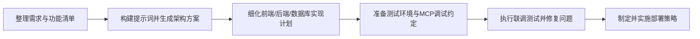

我打算写一篇文章去介绍怎么使用AI编程工具进行轻量的平台开发啊，这个平台它会有前端使用前端框架，也会有后端，比如Java，然后还会有对应的数据持久化使用数据库。然后我希望来梳理一下这篇文章的大纲，它应该包括如下这些部分：
首先是使用AI工具进行编程的一个基本的流程介绍，对吧
然后，这里面也包括就是首先要确定需求的说明，它可以是一个文档，也可以是一个清单，来说明你要开发的这个平台，它包含哪些功能模块，以及对应的模块的具体的描述。那这是第一个部分说明的部分。然后第二个就是确定完了这个说明之后，要将它使用一个陈列好的提示词生成整个平台的一个架构，说明架构方案吧，算是架构方案书。他主要是让AI去评估这个功能模块，它的整体的架构就是软件层面的一个架构了。前端使用什么技术，后端是用什么技术，数据库然后需要怎么样的去组合，把这个架构方案说明清楚，然后，包括你整体的功能涉及到哪些服务，然后那些模块，那这个都是在架构说明里面去阐述清楚的。然后，再下一个模块就是后续的功能的开发了。功能开发可能是不用再下一个模块，不是再下一个模块，应该是功能的部署测试和部署。对，那测试和部署的话，要说明就是功能在本地，因为使用AI编程嘛，你在测试的过程中会起伏，然后还要排查和分析问题。所以这个时候为了便于AI工具去分析，一般前端服务和后端服务要怎么部署要约定好，就怎么怎么怎么启动要约定好，然后数据库要怎么部署也要约定好。那这个是部署的环节，应该算是测试的环节。这是测试的环节，说错了，这个算是测试的环节吧，然后测试的环节还要使用哪些常见的MCP啊，也要有一个说明。然后再下一个环节就是部署了对吧？然后部署要使用容器还是使用什么也要有一个说明

---

## 大纲
1. AI编程流程概览：明确使用AI编码工具时从需求到上线的整体节奏与协作方式。
2. 需求说明与功能清单：整理平台功能模块、交互方式、前后端及数据库需求，形成AI可理解的输入。
3. 架构方案生成：借助提示词让AI输出前端框架、后端技术栈、数据库及服务拆分的架构说明书。
4. 测试与部署约定：定义本地/云端环境、前后端及数据库的启动策略、MCP使用规范，确保AI能够辅助排查问题。
5. 最终部署策略：决定容器化或其他交付方式，描述发布流程、监控与回滚方案。

## 内容描述
### 1. AI编程流程概览
解释如何围绕“需求 → 架构 → 测试 → 部署”的主线驱动工作，强调人机协同与快速反馈。

### 2. 需求说明与功能清单
列出平台的业务目标、关键功能模块及边界条件，覆盖前端交互、后端服务、数据库实体，确保AI输入完整。

### 3. 架构方案生成
利用标准化提示词请AI给出架构方案，包含技术选型、模块职责、服务依赖、前后端通信方式以及数据持久化策略。

### 4. 测试与部署约定
说明本地/云端测试环境、服务启动命令、数据库初始化方式以及常用MCP工具，便于AI在调试中定位问题。

### 5. 最终部署策略
对比容器化与其他交付方案，明确部署流水线、配置管理、监控告警与回滚策略，形成可执行指南。

