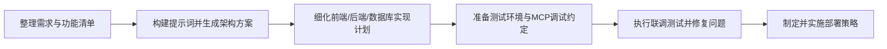

## 大纲
1. AI编程流程概览：明确使用AI编码工具时从需求到上线的整体节奏与协作方式。
2. 需求说明与功能清单：整理平台功能模块、交互方式、前后端及数据库需求，形成AI可理解的输入。
3. 架构方案生成：借助提示词让AI输出前端框架、后端技术栈、数据库及服务拆分的架构说明书。
4. 测试与部署约定：定义本地/云端环境、前后端及数据库的启动策略、MCP使用规范，确保AI能够辅助排查问题。
5. 最终部署策略：决定容器化或其他交付方式，描述发布流程、监控与回滚方案。

## 内容描述
### 1. AI编程流程概览
解释如何围绕“需求 → 架构 → 测试 → 部署”的主线驱动工作，强调人机协同与快速反馈。

### 2. 需求说明与功能清单
列出平台的业务目标、关键功能模块及边界条件，覆盖前端交互、后端服务、数据库实体，确保AI输入完整。

### 3. 架构方案生成
利用标准化提示词请AI给出架构方案，包含技术选型、模块职责、服务依赖、前后端通信方式以及数据持久化策略。

### 4. 测试与部署约定
说明本地/云端测试环境、服务启动命令、数据库初始化方式以及常用MCP工具，便于AI在调试中定位问题。

### 5. 最终部署策略
对比容器化与其他交付方案，明确部署流水线、配置管理、监控告警与回滚策略，形成可执行指南。

