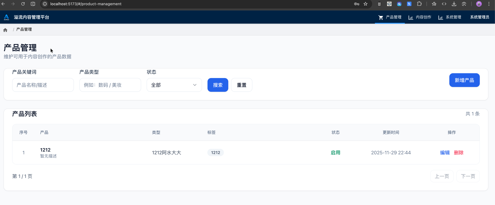
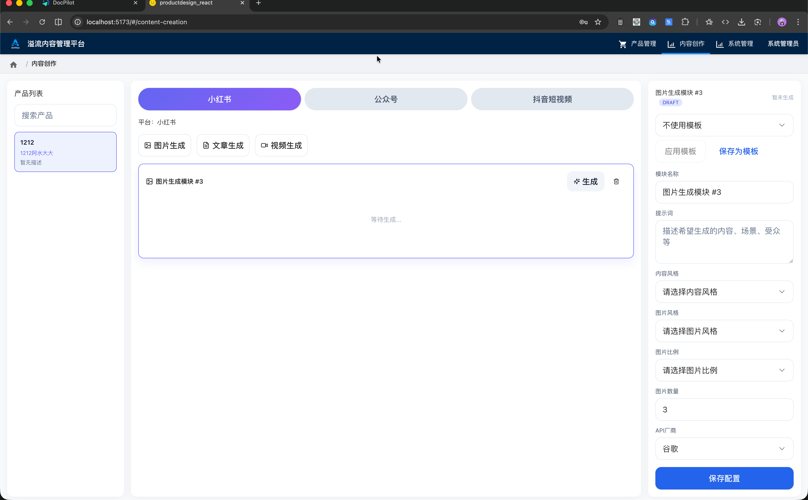

∏请你给系统增加用户管理模块。实现用户的增删改查功能，角色权限管理，登录认证和密码加密存储。
包括：
用户的增删改查
角色权限管理：页面权限和用户权限管理
登录认证和密码加密存储
默认有一个admin账号 

请你在现有的前端 后端数据库架构上实现该功能模块

请你给前端项目引入UI组件shadcn/ui

原始产品  
↓
生成内容：

一个专业的员工，产品设计经理和软件架构师。现在请你根据我的诉求，帮我规划一下这个软件平台的页面，页面规划方案。
我的诉求是这样子的：我希望有一个可以管理产品的地方，这个产品可以是我在电商网站上售卖的各种产品，我要对他们进行一些用调用大模型api生成宣传图图片和宣传文章以及宣传视频。最后还要将这些生成的内容，形成一个完整的社交媒体的内容发布到小红书平台。或者是其他的视频网站。抖音平台等等。

我希望能够统一的管理我的产品，然后在进行图片生成或者视频生成的时候可以指定一个大模型的api，并且可以指定生成的图片的风格或者视频的风格，并且可以调用默认的提示词。
同时也可以选择调用大模型的api的厂商，可以选择是谷歌的厂商或者是集梦的厂商。或者是豆包等等。
所以这里还涉及到另外一个模块，就是内容发布的模块，让他可以管理我生成的文章或者视频，并且通过调用小红书的api自动将文章发布出去。我可以预览要发布的内容，然后可以定时发布，或者是手动触发去发布。

我希望页面的布局是竖列的方式 尽量在一个页面显示产品管理、内容生成和预览、内容发布

我希望有：
- 产品管理页面 
负责产品的名称、基本描述、原始图、类型等信息的管理。
支持产品的增删改查。

- 内容创作页面
根据产品信息生成不同类型的内容：包括小红书内容、公众号内容、抖音视频内容。
    - 小红书内容包括：
        - 图内容
            支持配置生成模板。
            模板中可以设置生成的提示词、图片的风格、图片的尺寸、图片的数量；支持选择调用大模型的api的厂商，可以选择api：包括谷歌、豆包等等。
        - 正文
            支持配置生成模板。
            模板中可以设置生成的提示词、文章的风格、文章的长度；支持选择调用大模型的api的厂商，可以选择api：包括谷歌、豆包等等。

    - 公众号内容包括：
        - 图内容
            支持配置生成模板。
            模板中可以设置生成的提示词、图片的风格、图片的尺寸、图片的数量；支持选择调用大模型的api的厂商，可以选择api：包括谷歌、豆包等等。
        - 正文
            支持配置生成模板。
            模板中可以设置生成的提示词、文章的风格、文章的长度；支持选择调用大模型的api的厂商，可以选择api：包括谷歌、豆包等等。
    - 抖音视频内容包括：
        - 视频内容
            支持配置生成模板。
            模板中可以设置生成的提示词、视频的风格、视频的尺寸、视频的时长；支持选择调用大模型的api的厂商，可以选择api：包括谷歌、豆包等等。
        - 正文
            支持配置生成模板。
            模板中可以设置生成的提示词、文章的风格、文章的长度；支持选择调用大模型的api的厂商，可以选择api：包括谷歌、豆包等等。

我希望页面的布局是分为左中右三列：左列显示产品列表，中列显示内容创作页面，右列选择的模块的配置信息（包括配置的模板信息等）。
继续调整：
中间列显示空白，点击添加后可添加：图片生成模块、文章生成模块、视频生成模块。
选择其中一个模块后，在空白内容就会添加对应的模块，右侧列就显示当前模块的配置信息。

┌─────────────────────────────────────────────────────────────────────────────────────────────────────────────┐
│                                        内容创作平台 - 模块化布局设计                                          │
└─────────────────────────────────────────────────────────────────────────────────────────────────────────────┘

┌──────────────┬────────────────────────────────────────────────┬──────────────────────────────────────┐
│              │                                                │                                      │
│   左列       │              中列                              │           右列                       │
│  产品列表    │         内容创作画布                           │      模块配置面板                    │
│              │                                                │                                      │
├──────────────┼────────────────────────────────────────────────┼──────────────────────────────────────┤
│              │                                                │                                      │
│ ┌──────────┐ │  ┌──────────────────────────────────────────┐  │  ┌────────────────────────────────┐  │
│ │ 产品A    │ │  │ 平台: [小红书] [公众号] [抖音视频]       │  │  │  未选中任何模块                │  │
│ │ ────────│ │  │       ═══════                             │  │  │                                │  │
│ │          │ │  └──────────────────────────────────────────┘  │  │  请在左侧画布中添加或选择      │  │
│ │ 名称:... │ │                                                │  │  一个模块以查看配置选项        │  │
│ │ 类型:... │ │  ┌──────────────────────────────────────────┐  │  │                                │  │
│ │ 描述:... │ │  │ [+ 添加模块]                             │  │  │                                │  │
│ └──────────┘ │  │  ┌─────────┐ ┌─────────┐ ┌─────────┐    │  │  │         ╭─────────╮            │  │
│              │  │  │ 📷 图片  │ │ 📝 文章  │ │ 🎬 视频  │    │  │  │         │  (・ω・) │            │  │
│ ┌──────────┐ │  │  │  生成   │ │  生成   │ │  生成   │    │  │  │         │   等待   │            │  │
│ │ 产品B    │ │  │  └─────────┘ └─────────┘ └─────────┘    │  │  │         ╰─────────╯            │  │
│ │ ────────│ │  └──────────────────────────────────────────┘  │  │                                │  │
│ │          │ │                                                │  │                                │  │
│ │ 名称:... │ │  ┌────────────────────────────────────────┐  │  └────────────────────────────────┘  │
│ │ 类型:... │ │  │ 📷 图片生成模块 #1          [选中] [×] │  │                                      │
│ │ 描述:... │ │  ├────────────────────────────────────────┤  │  ┌────────────────────────────────┐  │
│ └──────────┘ │  │                                        │  │  │  📷 图片生成模块 #1            │  │
│              │  │  生成结果预览:                         │  │  │  ═══════════════               │  │
│ ┌──────────┐ │  │  ┌──────┐  ┌──────┐  ┌──────┐        │  │  │                                │  │
│ │ 产品C    │ │  │  │      │  │      │  │      │        │  │  │  生成提示词                    │  │
│ │ ────────│ │  │  │ 图1  │  │ 图2  │  │ 图3  │        │  │  │  ┌──────────────────────────┐  │  │
│ │          │ │  │  │      │  │      │  │      │        │  │  │  │ 请根据产品信息生成一张   │  │  │
│ │ 名称:... │ │  │  └──────┘  └──────┘  └──────┘        │  │  │  │ 适合小红书推广的宣传图   │  │  │
│ │ 类型:... │ │  │                                        │  │  │  │ 突出产品特点和卖点...    │  │  │
│ │ 描述:... │ │  │  [重新生成] [删除此模块]               │  │  │  └──────────────────────────┘  │  │
│ └──────────┘ │  └────────────────────────────────────────┘  │  │                                │  │
│              │                                                │  │  图片风格                      │  │
│ ┌──────────┐ │  ┌────────────────────────────────────────┐  │  │  ○ 写实  ● 商业  ○ 简约      │  │
│ │ 产品D    │ │  │ 📝 文章生成模块 #2                [×] │  │  │                                │  │
│ │ ────────│ │  ├────────────────────────────────────────┤  │  │  图片尺寸                      │  │
│ │          │ │  │                                        │  │  │  ○ 1:1  ● 16:9  ○ 9:16        │  │
│ │ 名称:... │ │  │  标题: [生成的标题]                    │  │  │                                │  │
│ │ 类型:... │ │  │                                        │  │  │  图片数量: [ 3 ] 张            │  │
│ │ 描述:... │ │  │  正文:                                 │  │  │                                │  │
│ └──────────┘ │  │  ┌──────────────────────────────────┐ │  │  │  API厂商                       │  │
│              │  │  │ 这是自动生成的文章内容...        │ │  │  │  ● 谷歌  ○ 豆包  ○ OpenAI     │  │
│ ┌──────────┐ │  │  │                                  │ │  │  │                                │  │
│ │ 产品E    │ │  │  │ 内容会根据产品信息和配置的...    │ │  │  ├────────────────────────────┤  │  │
│ │ ────────│ │  │  │                                  │ │  │  │ [应用模板 ▼]               │  │  │
│ │          │ │  │  └──────────────────────────────────┘ │  │  │  • 模板1: 产品推广         │  │  │
│ │ 名称:... │ │  │                                        │  │  │  • 模板2: 新品发布         │  │  │
│ │ 类型:... │ │  │  [重新生成] [编辑] [删除此模块]        │  │  │  • 模板3: 促销活动         │  │  │
│ │ 描述:... │ │  └────────────────────────────────────────┘  │  ├────────────────────────────┤  │  │
│ └──────────┘ │                                                │  │ [保存为新模板]             │  │  │
│              │  ┌────────────────────────────────────────┐  │  └────────────────────────────────┘  │
│              │  │ [+ 添加更多模块]                       │  │                                      │
│ [+ 新增]     │  └────────────────────────────────────────┘  │                                      │
│              │                                                │                                      │
│              │  ┌────────────────────────────────────────┐  │                                      │
│              │  │ [保存草稿] [预览全部] [发布到小红书]   │  │                                      │
│              │  └────────────────────────────────────────┘  │                                      │
│              │                                                │                                      │
└──────────────┴────────────────────────────────────────────────┴──────────────────────────────────────┘

═══════════════════════════════════════════════════════════════════════════════════════════════════════════

【模块添加流程示意】

初始状态 - 空白画布:
┌────────────────────────────────────────────┐
│ 平台: [小红书] [公众号] [抖音视频]         │
│       ═══════                               │
├────────────────────────────────────────────┤
│                                            │
│  [+ 添加模块]                              │
│   ┌─────────┐ ┌─────────┐ ┌─────────┐    │
│   │ 📷 图片  │ │ 📝 文章  │ │ 🎬 视频  │    │
│   │  生成   │ │  生成   │ │  生成   │    │
│   └─────────┘ └─────────┘ └─────────┘    │
│                                            │
│         (点击任意模块类型添加)              │
│                                            │
└────────────────────────────────────────────┘

点击"图片生成"后:
┌────────────────────────────────────────────┐
│ 📷 图片生成模块 #1          [选中] [×]     │  ← 新增的模块
├────────────────────────────────────────────┤
│ 生成结果预览:                              │
│ [等待生成...]                              │
│ [点击生成]                                 │
└────────────────────────────────────────────┘
│
│ [+ 添加更多模块]  ← 可继续添加
└────────────────────────────────────────────┘

添加多个模块后:
┌────────────────────────────────────────────┐
│ 📷 图片生成模块 #1          [选中] [×]     │
├────────────────────────────────────────────┤
│ [生成的图片预览]                           │
└────────────────────────────────────────────┘
│
┌────────────────────────────────────────────┐
│ 📝 文章生成模块 #2                  [×]    │  ← 点击可选中
├────────────────────────────────────────────┤
│ [生成的文章预览]                           │
└────────────────────────────────────────────┘
│
┌────────────────────────────────────────────┐
│ 🎬 视频生成模块 #3                  [×]    │
├────────────────────────────────────────────┤
│ [生成的视频预览]                           │
└────────────────────────────────────────────┘
│
│ [+ 添加更多模块]
└────────────────────────────────────────────┘

═══════════════════════════════════════════════════════════════════════════════════════════════════════════

【右侧配置面板 - 动态响应选中模块】

未选中任何模块时:
┌────────────────────────────────┐
│  未选中任何模块                │
│                                │
│  请在左侧画布中添加或选择      │
│  一个模块以查看配置选项        │
│                                │
│         ╭─────────╮            │
│         │  (・ω・) │            │
│         │   等待   │            │
│         ╰─────────╯            │
└────────────────────────────────┘

选中"图片生成模块"时:
┌────────────────────────────────┐
│  📷 图片生成模块 #1            │
│  ═══════════════               │
│                                │
│  生成提示词                    │
│  ┌──────────────────────────┐  │
│  │ [提示词内容]             │  │
│  └──────────────────────────┘  │
│                                │
│  图片风格                      │
│  ○ 写实  ● 商业  ○ 简约      │
│                                │
│  图片尺寸                      │
│  ○ 1:1  ● 16:9  ○ 9:16        │
│                                │
│  图片数量: [ 3 ] 张            │
│                                │
│  API厂商                       │
│  ● 谷歌  ○ 豆包  ○ OpenAI     │
│                                │
│  [应用模板 ▼]                 │
│  [保存为新模板]               │
└────────────────────────────────┘

选中"文章生成模块"时:
┌────────────────────────────────┐
│  📝 文章生成模块 #2            │
│  ═══════════════               │
│                                │
│  生成提示词                    │
│  ┌──────────────────────────┐  │
│  │ [提示词内容]             │  │
│  └──────────────────────────┘  │
│                                │
│  文章风格                      │
│  ○ 专业  ● 轻松  ○ 幽默      │
│                                │
│  文章长度                      │
│  ○ 短(300字)                  │
│  ● 中(800字)                  │
│  ○ 长(1500字)                 │
│                                │
│  API厂商                       │
│  ● 谷歌  ○ 豆包  ○ OpenAI     │
│                                │
│  [应用模板 ▼]                 │
│  [保存为新模板]               │
└────────────────────────────────┘

选中"视频生成模块"时:
┌────────────────────────────────┐
│  🎬 视频生成模块 #3            │
│  ═══════════════               │
│                                │
│  生成提示词                    │
│  ┌──────────────────────────┐  │
│  │ [提示词内容]             │  │
│  └──────────────────────────┘  │
│                                │
│  视频风格                      │
│  ○ 实拍  ● 动画  ○ 混合      │
│                                │
│  视频尺寸                      │
│  ○ 横版  ● 竖版  ○ 方形      │
│                                │
│  视频时长: [ 30 ] 秒           │
│                                │
│  API厂商                       │
│  ● 谷歌  ○ 豆包  ○ OpenAI     │
│                                │
│  [应用模板 ▼]                 │
│  [保存为新模板]               │
└────────────────────────────────┘

═══════════════════════════════════════════════════════════════════════════════════════════════════════════

【核心交互逻辑】

1️⃣  左列选择产品
    ↓
2️⃣  中列顶部选择平台 (小红书/公众号/抖音)
    ↓
3️⃣  点击 [+ 添加模块] → 选择模块类型 (图片/文章/视频)
    ↓
4️⃣  模块添加到画布中 → 自动选中该模块
    ↓
5️⃣  右列显示该模块的配置选项
    ↓
6️⃣  配置参数 → 点击生成 → 中列显示生成结果
    ↓
7️⃣  可继续添加更多模块,组合成完整内容
    ↓
8️⃣  点击模块可切换选中状态 → 右列配置面板同步更新
    ↓
9️⃣  完成后保存草稿或直接发布

═══════════════════════════════════════════════════════════════════════════════════════════════════════════

【模块管理功能】

- 添加模块: 点击 [+ 添加模块] 选择类型
- 选中模块: 点击模块标题栏,右侧显示配置
- 删除模块: 点击模块右上角的 [×]
- 排序模块: 拖拽模块上下调整顺序 (可选功能)
- 复制模块: 快速复制已配置的模块 (可选功能)

【模块状态】

- 未生成: 显示 [点击生成] 按钮
- 生成中: 显示加载动画
- 已生成: 显示生成结果和 [重新生成] 按钮
- 选中状态: 标题栏高亮显示 [选中]

- 内容发布页面

产品管理 和内容创作是一级菜单 将他们放在导航栏的左侧 

请你优化产品管理页面功能：
新产品的时候，没有“展示图 URL”、“原始图 URL”字段，请清理所有代码和ORM映射.
新增一个字段：产品图。
用户上传产品图的时候，可以上传多个图片，然后选择一个作为主产品图。
在产品管理页面中，可以查看产品图，并且可以删除产品图。点击产品名称，可以进入产品详情页面，在产品详情页面中，可以查看产品图，并且可以删除产品图。

请你新增一个提示词管理页面，实现对提示词的增删改查功能。
提示词包括：提示词名称、提示词内容、提示词类型、提示词创建时间、提示词更新时间。
提示词类型包括：图片提示词、文章提示词、视频提示词。
提示词内容包括：提示词的名称、提示词的内容、提示词的创建时间、提示词的更新时间。
提示词的创建时间、提示词的更新时间：自动生成，不需要用户输入。
提示词的名称、提示词的内容：需要用户输入。
提示词的类型：需要用户选择。
提示词的创建时间、提示词的更新时间：自动生成，不需要用户输入。
提示词的名称、提示词的内容：需要用户输入。
提示词的类型：需要用户选择。

创建的提示词 在http://localhost:5173/#/content-creation 页面中 提示词配置模块中 可以选择使用。

http://localhost:5173/#/content-creation 页面》图片输出模块 新增功能：
模块名称下增加一个配置字段：
字段名称：“主体图”。
默认显示在产品管理中上传的图片缩略图。用户可以勾选缩略图，作为主体图。
l提示词增加变量：{主体图}。
用户在选择好提示词和主体图后，点击生成按钮，会自动将提示词和主体图传递给大模型。即替换 变量：{主体图}。为用户选择的图片。大模型会根据提示词和主体图生成图片。

大模型生图的api说明：“DocFile/cookbook/quickstarts/Get_started_imagen.ipynb”

请你在提示词管理页面中，新增一个tab页面：提示词变量管理。
提示词变量管理页面中，可以管理提示词变量。
提示词变量包括：变量名称、变量内容、变量创建时间、变量更新时间。
变量的创建时间、变量的更新时间：自动生成，不需要用户输入。
变量的名称、变量的内容：需要用户输入。

变量有：
- 主体图：
- 风格参考图

请你分析 参考下面项目中的对大模型的api接入和调用管理过程和方法，给本项目增加类型的大模型接入调用管理模块。

给系统增加一个一级模块：”系统管理“。包括二级模块：”大模型接入“、”线程管理“、”模型对比“模块。
要加入原有大模型的接入。
请仔细分析在本项目实现前端、后端、数据库、api并高质量实现。

待参考：
frontend/src/pages/AdminPage/components/SystemConfigSubSections/AdvancedConfigurationSection.jsx
frontend/src/pages/AdminPage/components/SystemConfigSubSections/AIConfigurationSection.jsx
frontend/src/pages/AdminPage/components/SystemConfigSubSections/ModelComparisonPanel.jsx
frontend/src/pages/AdminPage/components/SystemConfigSubSections/PerformanceConfigurationSection.jsx
backend/services/llm_quota_service.py
backend/services/llm_router.py
backend/services/model_comparison_service.py
backend/services/reasoning_stream_manager.py

> 请修改 AntFlow_frontend/src/components/ui/page-container.tsx   让列表的分页组件都在列表的右下方  

请完整重构下 http://localhost:5173/#/llm-access  功能：
因为大模型的api参数会因为厂商和生成内容类型不同 对应的参数不同，所以需要根据厂商和生成内容类型不同 确定后，配置对应的api参数。
模型厂商：模型厂商
模型类型：原名为“模型类型”，现改为“生成内容类型”
模型名称：模型名称
模型编码：模型编码
接口地址：接口地址
API Key：API Key
状态：启用/停用
默认模型：是/否
模型标识：模型标识

其他的温度、seed都是根据模型类型不同 对应的参数不同，按需配置。没有的参数不显示。

要求完整调整前端 后端 数据库 接口 代码，并确保功能完整。

请你给http://localhost:5173/#/llm-access 下增加更多厂商的api接入。要求：

- API的调用方法参考下面的文件：
    /Users/zhangxy/GenAI/DocPilot/backend/services/content_generation/doubao_client.py
    /Users/zhangxy/GenAI/DocPilot/backend/services/content_generation/glm_client.py
    /Users/zhangxy/GenAI/DocPilot/backend/services/content_generation/kimi_client.py
    /Users/zhangxy/GenAI/DocPilot/backend/services/content_generation/qwen_client.py
    /Users/zhangxy/GenAI/DocPilot/backend/services/content_generation/service.py
    /Users/zhangxy/GenAI/DocPilot/backend/services/llm_router.py
    /Users/zhangxy/GenAI/DocPilot/backend/services/llm_quota_service.py

- 按照现有的api接入管理页面，增加厂商的api接入管理。
- 新增的这些模型的类型是”通用文本模型“。

我希望使用 “/Users/zhangxy/GenAI/AntFlow/one-api”  这个项目来统一接入大模型的api   不再使用原有的 “http://localhost:5173/#/llm-access”  。
你需要做：
- 将原有的功能全部代码备份  默认使用one-api 接入外部api
- 配置一个开关来切换使用原有的
